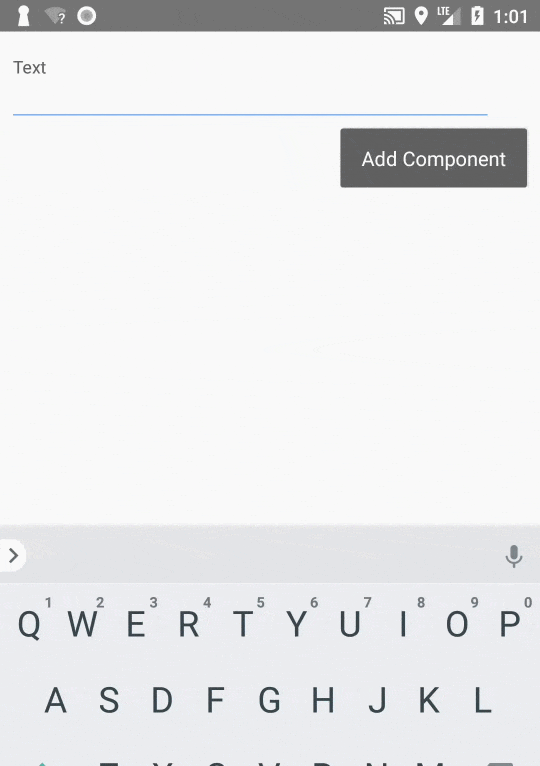
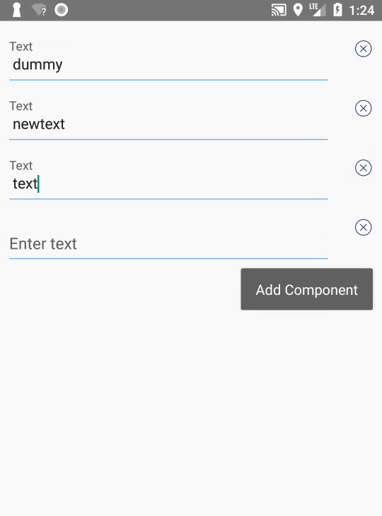

# react-native-multicomponent

A `<EwMultipleComponentValue>` component for React Native to add and delete a component multiple times.

## Installation

`npm install multicomponent --save`

## Usage
```javascript
<EwMultipleComponentValue
  component = { <Test /> }                  // Component to render multiple times
  componentStateArray = { testArray }       // Array containing state value of the component.
  isAddButtonVisible = { true }             // To show add button for component
  otherDetails = {{ testDetails: 'test' }}  // To pass custom details to the component
  isDeleteButtonVisible = { false }         // To show delete button for component
  onAddButtonPressed = { () => this.addCommentToServer() }  // To add custom functionality when add button is clicked
  updateParentState = { (componentState,componentKey) => this.updateParentState(componentState,componentKey) }  // To update parent state when component state is changed
  addLabel = "Add Component"     // Label for the add button
  showDeleteAlertbox = { true } // To show delete alertbox of component is deleted.
  alertboxData = {{ heading: 'Test', message: 'Do you want to delete this ?'  }} // To add custom heading and messaging if show alertbox is true
/>
```
## Demo (Add button)



## Demo (Delete button)


